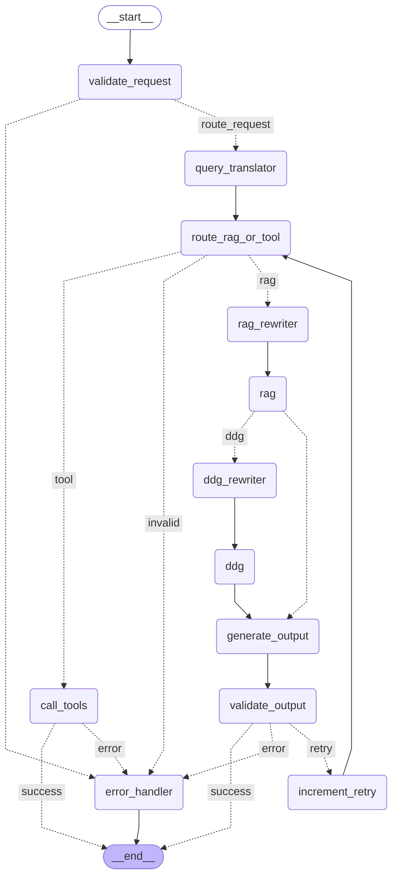

# 🕷️ AIrachnid

Персональный домашний AI-агент на базе LangGraph. Умеет искать игры из личной библиотеки, управлять умным освещением WiZ и медиаплеером VLC — всё через Telegram.

## Возможности

- **Поиск по библиотеке игр** — семантический поиск через RAG (PostgreSQL + pgvector). Если игра не найдена в базе — агент ищет в интернете через DuckDuckGo.
- **Управление освещением** — включить/выключить, яркость, RGB-цвет, переключение режимов (WiZ).
- **Управление медиаплеером** — play/pause/stop, следующий/предыдущий трек, громкость, перемотка (VLC).
- **Telegram UI** — текстовый интерфейс с whitelist пользователей.
- **Мониторинг** — трейсинг всех вызовов через Langfuse.

## Архитектура

### Граф агента (LangGraph)



**Узлы:**

| Узел                | Описание                                                                                                                                                                    |
| ------------------- | --------------------------------------------------------------------------------------------------------------------------------------------------------------------------- |
| `validate_request`  | Нормализация, regexp-фильтр на prompt injection (EN + RU), LLM-проверка с "safe by default" поведением                                                                      |
| `query_translator`  | Перевод запроса на английский — выполняется сразу после валидации для всех веток графа (вся библиотека на английском, локальная LLM лучше работает с EN)                    |
| `route_rag_or_tool` | Классификация намерения: поиск игр или управление устройством                                                                                                               |
| `rag_rewriter`      | Переформулирование запроса для гибридного поиска                                                                                                                            |
| `rag`               | Гибридный поиск по библиотеке игр: векторный (pgvector) + полнотекстовый (pg_trgm), результаты объединяются через RRF                                                       |
| `ddg_rewriter`      | Переформулирование запроса для DuckDuckGo                                                                                                                                   |
| `ddg`               | Поиск в интернете, если результаты гибридного поиска неудовлетворительны (semantic score выше порога)                                                                       |
| `call_tools`        | pydantic-ai агент: выбор инструмента, валидация параметров по MCP-схеме, выполнение и формулировка ответа — всё в одном узле. До `TOOL_CALL_MAX_RETRIES` попыток при ошибке |
| `generate_output`   | Формулировка ответа по результатам поиска                                                                                                                                   |
| `validate_output`   | Независимая LLM-оценка финального ответа (релевантность + полнота). При низком score — retry через `route_rag_or_tool` (до `MAX_RETRIES` раз), иначе `error_handler`        |
| `increment_retry`   | Увеличивает счётчик попыток в state перед повторным проходом графа                                                                                                          |
| `error_handler`     | Обработка ошибок                                                                                                                                                            |

**Точки ветвления:**

1. После `validate_request` — пропустить запрос или отклонить
2. После `route_rag_or_tool` — поиск игр или управление устройством
3. После `rag` — результаты гибридного поиска удовлетворительны или идти в DuckDuckGo
4. После `call_tools` — успешное выполнение или все попытки исчерпаны
5. После `validate_output` — ответ принят, retry или ошибка

### Сервисы

```
┌─────────────┐
│   tg-bot    │──┐
│  (aiogram)  │  │   HTTP    ┌─────────────┐     MCP/HTTP    ┌─────────────┐
└─────────────┘  ├─────────► │    agent    │ ──────────────► │  mcp-server │
┌─────────────┐  │           │  (FastAPI + │                 │  (FastMCP)  │
│     cli     │──┘           │  LangGraph) │                 └──────┬──────┘
│ (docker run)│              └──────┬──────┘                        │
└─────────────┘                     │                         ┌─────┴─────┐
                              ┌──────┴──────┐                  │ WiZ / VLC │
                              │  postgres   │                  │ (хост)    │
                              │  (pgvector  │                  └───────────┘
                              │  + pg_trgm) │
                              ├─────────────┤
                              │    redis    │
                              │ (redis-stack│
                              │ + sessions) │
                              └─────────────┘

                              Langfuse Cloud      Ollama (хост)        OpenRouter
                              (мониторинг)        mxbai-embed-large    (опционально,
                                                   llama3.1:8b/gemma2:2b облачные LLM)
```

`tg-bot` и `cli` — два равноправных клиента одного `agent`, оба используют один и тот же HTTP API (`/invoke`, `/reindex`). `cli` поднимается как отдельный профиль в `docker-compose` для отладки и проверки без Telegram.

LLM-провайдер переключается через `.env` (`LLM_PROVIDER=ollama` или `openrouter`) — граф и узлы не знают, откуда приходит модель.

### MCP-инструменты

**Освещение (WiZ):**

- `toggle` — переключить состояние
- `turn-on` / `turn-off` — включить/выключить
- `set-brightness` — яркость (0–255)
- `set-rgb` — цвет (RGB 0–255)
- Resource `light://state` — текущее состояние ламп

**Медиаплеер (VLC):**

- `vlc_play` / `vlc_pause` / `vlc_stop` — управление воспроизведением
- `vlc_next` / `vlc_prev` — следующий/предыдущий трек
- `seek` — перемотка (`+30s`, `-1m`, `1h30m`)
- `set_volume` — громкость (0–200%)
- `adjust_volume` — изменить громкость на ±%
- Resource `vlc://status` — текущее состояние плеера

## Стек технологий

| Компонент            | Технология                                   | Обоснование                                                                                                                       |
| -------------------- | -------------------------------------------- | --------------------------------------------------------------------------------------------------------------------------------- |
| Оркестрация агента   | LangGraph                                    | Нативная поддержка нелинейных графов, checkpointing, retry-петли                                                                  |
| LLM                  | Ollama (llama3.1:8b, gemma2:2b) / OpenRouter | Локальный запуск по умолчанию; OpenRouter — переключаемый облачный провайдер для лучшего качества на русском языке и tool calling |
| Tool calling         | pydantic-ai                                  | Валидация параметров tool calls по схеме MCP-инструмента, автоматический retry при невалидном вызове                              |
| Embeddings           | mxbai-embed-large (Ollama)                   | Лучшее качество на смешанных языках среди локальных моделей                                                                       |
| Векторное хранилище  | PostgreSQL + pgvector                        | Единая БД для данных и векторов, не нужен отдельный сервис                                                                        |
| Полнотекстовый поиск | pg_trgm                                      | Гибридный поиск (RRF) без дополнительных сервисов, улучшает точность для точных названий                                          |
| Сессии               | Redis Stack                                  | TTL из коробки, RediSearch для LangGraph checkpointer                                                                             |
| MCP                  | FastMCP (HTTP/SSE)                           | Изоляция инструментов в отдельном сервисе, доступ к хосту                                                                         |
| Мониторинг           | Langfuse Cloud                               | Трейсинг LangGraph + pydantic-ai в едином трейсе (OTEL), бесплатный tier (50k observations/month)                                 |
| UI                   | Telegram (aiogram) + CLI                     | Telegram — основной интерфейс; CLI — для отладки и проверки без бота                                                              |

## Требования

- Docker и Docker Compose
- [Ollama](https://ollama.com/) на хосте с загруженными моделями:

    ```bash
    ollama pull llama3.1:8b
    ollama pull gemma2:2b
    ollama pull mxbai-embed-large
    ```

    - Возможен запуск ollama в контейнере
    - Возможно использование OpenRouter

- VLC запущен с HTTP-интерфейсом:
    ```bash
    vlc --intf http --http-host 127.0.0.1 --http-port 8080 --http-password <пароль>
    ```
- Лампочки WiZ в локальной сети
- Telegram-бот (создать через [@BotFather](https://t.me/BotFather)) (необязательно, доступен cli-интерфейс)

## Установка и запуск

### 1. Клонировать репозиторий

```bash
git clone https://github.com/iarspider/airachnid.git
cd airachnid
```

### 2. Настроить переменные окружения

```bash
cp .env.example .env
```

Заполнить `.env` (см. раздел [Переменные окружения](#переменные-окружения)).

### 3. Настроить Ollama

**Вариант А — Ollama на хосте (рекомендуется при наличии GPU):**

Ollama должна быть доступна из Docker-контейнеров. По умолчанию она слушает только на `127.0.0.1` — нужно изменить:

```bash
# /etc/systemd/system/ollama.service.d/override.conf
[Service]
Environment="OLLAMA_HOST=0.0.0.0:11434"
```

```bash
systemctl daemon-reload && systemctl restart ollama
```

В `.env` оставить:

```
OLLAMA_BASE_URL=http://host-gateway:11434
```

**Вариант Б — Ollama в Docker Compose:**

Раскомментировать секцию `ollama` в `docker-compose.yml` и добавить зависимость в `agent`:

```yaml
ollama:
    image: ollama/ollama:latest
    container_name: ollama
    ports:
        - "11434:11434"
    volumes:
        - ollama:/root/.ollama
    restart: unless-stopped
    networks: [internal]
    healthcheck:
        test:
            ["CMD-SHELL", "wget -qO- http://127.0.0.1:11434/api/tags || exit 1"]
    # Для GPU:
    deploy:
        resources:
            reservations:
                devices:
                    - driver: nvidia
                      count: 1
                      capabilities: [gpu]
```

В `.env` изменить:

```
OLLAMA_BASE_URL=http://ollama:11434
```

После запуска загрузить модели:

```bash
docker exec -it ollama ollama pull llama3.1:8b
docker exec -it ollama ollama pull gemma2:2b
docker exec -it ollama ollama pull mxbai-embed-large
```

### Вариант В — OpenRouter (облачные модели)

Не требует локальной Ollama для генерации ответов (embeddings всё равно через Ollama). В `.env`:

```
LLM_PROVIDER=openrouter
OPENROUTER_API_KEY=sk-or-...
OPENROUTER_MODEL=openai/gpt-4o-mini
```

Переключение между провайдерами — только смена `LLM_PROVIDER`, граф и узлы не меняются. Облачные модели заметно лучше справляются с tool calling и русским языком, но это уже не "локальный помощник".

### 4. Запустить сервисы

```bash
docker compose up -d
```

Порядок старта управляется `depends_on` с `healthcheck` — сервисы поднимаются в правильном порядке автоматически.

### 5. Настроить Langfuse

Зарегистрироваться на [cloud.langfuse.com](https://cloud.langfuse.com), создать проект и скопировать ключи в `.env`:

```
LANGFUSE_BASE_URL=https://cloud.langfuse.com
LANGFUSE_PUBLIC_KEY=pk-lf-...
LANGFUSE_SECRET_KEY=sk-lf-...
```

Бесплатный tier включает 50 000 observations в месяц — достаточно для разработки и личного использования.

### 6. Проиндексировать базу игр

Отправить боту команду `/reindex` в Telegram. Команда создаёт (при первом запуске) или обновляет таблицу эмбеддингов в PGVectorStore — сравнивает игры в основной БД с уже проиндексированными и добавляет новые.

### 7. Написать боту в Telegram

Найти бота по имени заданному при создании, написать `/start`.

### 7а. Альтернатива — CLI интерфейс

Telegram необязателен — можно работать с агентом напрямую через консоль:

```bash
docker compose --profile cli run --rm cli
```

```
🕷️  AIrachnid CLI  (session: 3f1a...)
Type your message. Commands: /reindex, /exit

You> найди игру про котиков
🤖 В вашей библиотеке есть несколько игр про котиков: Stray, Cat Quest...
```

`cli` использует тот же HTTP API агента (`/invoke`, `/reindex`) что и `tg-bot` — поведение идентично, удобно для отладки без Telegram.

## Переменные окружения

Скопировать `.env.example` в `.env` и заполнить:

```env
# PostgreSQL (суперпользователь)
POSTGRES_ADMIN_USER=
POSTGRES_ADMIN_PASSWORD=
POSTGRES_DB=airachnid
POSTGRES_HOST=database
POSTGRES_PORT=5432

# PostgreSQL (пользователи сервисов)
AGENT_DB_USER=agent_user
AGENT_DB_PASSWORD=
LANGFUSE_DB_USER=langfuse_user
LANGFUSE_DB_PASSWORD=

# Redis
REDIS_HOST=cache
REDIS_PORT=6379
REDIS_PASSWORD=

# LLM-провайдер: ollama (по умолчанию) или openrouter
LLM_PROVIDER=ollama

# Ollama (на хосте)
OLLAMA_BASE_URL=http://host-gateway:11434
OLLAMA_MODEL=llama3.1:8b
OLLAMA_CLASSIFIER_MODEL=gemma2:2b

# OpenRouter (используется, если LLM_PROVIDER=openrouter)
OPENROUTER_API_KEY=
OPENROUTER_MODEL=openai/gpt-4o-mini

# MCP-сервер
MCP_SERVER_HOST=mcp-server
MCP_SERVER_PORT=8000

# VLC HTTP API
VLC_HTTP_HOST=127.0.0.1
VLC_HTTP_PORT=8080
VLC_HTTP_PASSWORD=

# WiZ (формат: ip:mac,ip:mac)
WIZ_BULBS=

# Размер вектора (mxbai-embed-large = 1024)
VECTOR_SIZE=1024
TABLE_NAME=game_embeddings

# Гибридный поиск
SEARCH_ALPHA=0.5            # вес семантического поиска в RRF (0.5 = равный вес с BM25)
SEARCH_THRESHOLD=0.45       # порог semantic score для перехода в DDG

# Retry
TOOL_CALL_MAX_RETRIES=3
MAX_RETRIES=3

# Агент
AGENT_HOST=agent
AGENT_PORT=8000

# Telegram (необязательно — доступен CLI)
TELEGRAM_BOT_TOKEN=
# Whitelist пользователей (Telegram username через запятую)
WHITELIST=

# Langfuse Cloud
LANGFUSE_BASE_URL=https://cloud.langfuse.com
LANGFUSE_PUBLIC_KEY=
LANGFUSE_SECRET_KEY=
```

## Порты

| Сервис     | Порт        | Описание        |
| ---------- | ----------- | --------------- |
| agent      | 8000        | REST API агента |
| mcp-server | 8000 (хост) | MCP HTTP/SSE    |
| postgres   | 5432        | PostgreSQL      |
| redis      | 6379        | Redis           |

## Известные ограничения

- **Семантический поиск** — работает хорошо для точных названий и тематических запросов ("игры про котиков", "open world RPG"), хуже для нестандартных ассоциативных запросов. Гибридный поиск (RRF: pgvector + pg_trgm) частично компенсирует это для точных названий.
- **WiZ** — управление всеми лампочками сразу, без возможности выбрать конкретную. Нет проверки capabilities лампочки перед передачей команды (например, смена цвета на не-RGB лампочке).
- **Локальная LLM как судья** (`validate_output`) — менее надёжна чем облачная, возможны ложные срабатывания. При использовании `LLM_PROVIDER=openrouter` оценка качественнее.

## Eval / Benchmark

Тестовый набор из 16+ кейсов (`evals/benchmark.py`) — 12 для RAG-ветки (точные названия EN/RU, тематические запросы EN/RU, серии игр, игра отсутствует в базе), 4 для tool-ветки (управление светом и VLC).

Три типа проверок на каждый кейс, как и требуется по заданию:

1. **Программный assert** — детерминированные проверки без LLM: ответ не пустой, нет ошибки в response, ожидаемое название встречается в ответе (substring match), отсутствуют маркеры "не нашёл" для игр которые точно есть в базе.
2. **LLM-as-judge** — pydantic-ai агент с `output_type=NativeOutput(JudgeVerdict)` оценивает финальный ответ по `relevance`, `no_hallucination` и общему `score` (0.0–1.0).
3. **Tool-call check** — для tool-ветки проверяется что вызван ожидаемый MCP-инструмент и не вызваны запрещённые (например, для "turn on the lights" не должен вызываться `vlc_play`).

Запуск:

```bash
# через pytest, с параметризацией по каждому кейсу
uv run pytest evals/benchmark.py -v

# standalone, с сводкой success rate
uv run python evals/benchmark.py
```

Локальные модели (особенно как судья) дают определённый разброс между запусками. Для нестабильных кейсов используется `pytest-rerunfailures` (`@pytest.mark.flaky(reruns=3)`).

## Security Checklist

### Input validation

| Пункт                                                        | Статус         | Комментарий                                                                                                                                                                                                                           |
| ------------------------------------------------------------ | -------------- | ------------------------------------------------------------------------------------------------------------------------------------------------------------------------------------------------------------------------------------- |
| Нормализация входных данных (удаление непечатаемых символов) | ✅ Реализовано | `validate_request`                                                                                                                                                                                                                    |
| Regexp-фильтр на prompt injection (EN + RU)                  | ✅ Реализовано | `validate_request`                                                                                                                                                                                                                    |
| LLM-проверка на prompt injection                             | ⚠️ Отключено   | Протестированы: gemma2:2b (LLM) и mDeBERTa (zero-shot classifier) — оба дают неприемлемый уровень ложных срабатываний на русскоязычных запросах. Включается флагом `ENABLE_LLM_VALIDATION=true` в `.env` при переходе на облачную LLM |
| Ограничение длины входного сообщения                         | ✅ Реализовано | Telegram ограничивает до 4096 символов                                                                                                                                                                                                |
| Whitelist пользователей                                      | ✅ Реализовано | Только пользователи из `WHITELIST` в `.env`                                                                                                                                                                                           |

### Output validation

| Пункт                                                  | Статус         | Комментарий                                                      |
| ------------------------------------------------------ | -------------- | ---------------------------------------------------------------- |
| LLM-оценка финального ответа (релевантность + полнота) | ✅ Реализовано | `validate_output`, score 0.0–1.0                                 |
| Retry при низком качестве ответа                       | ✅ Реализовано | До `MAX_RETRIES` попыток, затем `error_handler`                  |
| Фильтрация галлюцинаций                                | ⚠️ Частично    | `validate_output` снижает вероятность, но не исключает полностью |

### Tool safety

| Пункт                                           | Статус            | Комментарий                                           |
| ----------------------------------------------- | ----------------- | ----------------------------------------------------- |
| Валидация параметров tool calls                 | ✅ Реализовано    | pydantic-ai валидирует по схеме MCP-инструмента       |
| Retry при невалидном tool call                  | ✅ Реализовано    | До `TOOL_CALL_MAX_RETRIES` попыток                    |
| Allowlist инструментов                          | ✅ Реализовано    | Только инструменты, зарегистрированные на MCP-сервере |
| Ограничение scope инструментов                  | ✅ Реализовано    | WiZ — только локальная сеть, VLC — только localhost   |
| Проверка capabilities устройства перед командой | ❌ Не реализовано | Например, смена цвета на не-RGB лампочке              |

### Infrastructure

| Пункт                                             | Статус            | Комментарий                                             |
| ------------------------------------------------- | ----------------- | ------------------------------------------------------- |
| Разделение прав БД (superuser / agent / langfuse) | ✅ Реализовано    | Агент имеет только SELECT/INSERT/UPDATE на свои таблицы |
| Пароли вынесены в `.env`                          | ✅ Реализовано    | `.env` в `.gitignore`                                   |
| Сервисы изолированы в Docker network              | ✅ Реализовано    | `internal` network, наружу только нужные порты          |
| MCP-сервер недоступен из внутренней сети          | ✅ Реализовано    | `network_mode: host`, доступен только с хоста           |
| HTTPS                                             | ❌ Не применимо   | Локальный деплой, публичного URL нет                    |
| Rate limiting                                     | ❌ Не реализовано | Один пользователь в whitelist, не критично              |
| Аутентификация API агента                         | ❌ Не реализовано | API доступен только внутри Docker network               |

### Monitoring

| Пункт                                                               | Статус            | Комментарий                              |
| ------------------------------------------------------------------- | ----------------- | ---------------------------------------- |
| Трейсинг всех LLM-вызовов (LangGraph + pydantic-ai в едином трейсе) | ✅ Реализовано    | Langfuse Cloud, OTEL context propagation |
| Логирование ошибок                                                  | ✅ Реализовано    | loguru + Langfuse                        |
| Алертинг                                                            | ❌ Не реализовано | Не критично для личного использования    |

## Проектные решения

### Какую задачу решает агент?

AIrachnid — персональный домашний ассистент, который позволяет управлять умным домом и искать игры в личной библиотеке через текстовый интерфейс (Telegram или CLI). Агент принимает запросы на естественном языке и либо возвращает информацию об играх, либо выполняет действия с устройствами (освещение WiZ, медиаплеер VLC).

### Кто пользователь?

Один конкретный пользователь — владелец системы. Доступ ограничен whitelist'ом в Telegram-боте; CLI используется локально для отладки.

### С какими внешними системами и данными работает агент?

| Система             | Роль                                                                              |
| ------------------- | --------------------------------------------------------------------------------- |
| PostgreSQL          | Основная БД с библиотекой игр (метаданные, жанры, темы, серии)                    |
| pgvector            | Векторное хранилище эмбеддингов для семантического поиска                         |
| pg_trgm             | Полнотекстовый поиск, объединяется с векторным через RRF                          |
| Redis Stack         | Хранение сессий и состояний диалога (LangGraph checkpointer)                      |
| Ollama / OpenRouter | LLM (llama3.1:8b, gemma2:2b или облачные модели) и embeddings (mxbai-embed-large) |
| WiZ                 | Управление умными лампочками по локальной сети (UDP)                              |
| VLC HTTP API        | Управление медиаплеером                                                           |
| DuckDuckGo          | Поиск игр, не найденных в локальной БД                                            |
| Langfuse Cloud      | Мониторинг и трейсинг вызовов                                                     |

### Почему агент, а не детерминированный пайплайн?

Запросы пользователя непредсказуемы по форме — "включи что-нибудь расслабляющее" и "поставь на паузу" требуют принципиально разных действий, но система должна сама определить, что именно нужно сделать. Детерминированный пайплайн потребовал бы явной классификации каждого возможного намерения.

Один агент с разветвлённым графом справляется лучше, чем несколько независимых агентов (RAG-агент + device-агент): запросы пользователя заранее не размечены по типу, разделение на отдельных агентов потребовало бы либо дублирования классификации, либо отдельного оркестратора верхнего уровня — то есть фактически того же графа, но менее прозрачного.

Агент адаптируется к контексту:

- читает текущее состояние устройств через MCP resources перед выполнением команды
- выбирает стратегию поиска (гибридный RAG или DDG) в зависимости от результата
- переформулирует и переводит запрос для улучшения качества поиска и tool calling
- повторяет генерацию ответа, если независимая оценка признала его неудовлетворительным

### Какие сложные/нестандартные ситуации ожидаются?

**1. Устройство недоступно** — лампочка offline или VLC не запущен. MCP-сервер возвращает структурированную ошибку, агент сообщает пользователю вместо зависания.

**2. Неоднозначный запрос** — "включи" без уточнения что именно. Агент принимает решение по контексту (если запрос попал в ветку tool, скорее всего имеется в виду свет) или формулирует уточняющий ответ.

**3. Игра не найдена в базе** — агент автоматически переключается на DuckDuckGo. Гибридный поиск снижает вероятность ложного "не найдено" для точных названий.

**4. Prompt injection** — входящие сообщения проходят нормализацию и regexp-фильтр по известным паттернам атак (EN + RU). LLM-проверка отключена по умолчанию из-за ложных срабатываний локальных моделей.

**5. Локальная модель генерирует невалидный tool call** — pydantic-ai валидирует параметры по схеме MCP-инструмента и возвращает модели сообщение об ошибке для исправления. До `TOOL_CALL_MAX_RETRIES` попыток, после — `error_handler`.

**6. Неудовлетворительный финальный ответ** — `validate_output` независимо оценивает ответ. При низком score и `retries < MAX_RETRIES` граф возвращается на `route_rag_or_tool` через `increment_retry`. После исчерпания попыток — `error_handler`.

### Как понять, что агент работает хорошо?

| Критерий              | Метрика                                                                                                                        | Приемлемый результат                                       |
| --------------------- | ------------------------------------------------------------------------------------------------------------------------------ | ---------------------------------------------------------- |
| Точность routing      | Доля запросов, правильно классифицированных в rag/tool/invalid                                                                 | ≥ 90% на benchmark-наборе                                  |
| Точность tool calling | Доля запросов к устройствам, где вызван правильный инструмент с корректными параметрами (см. `evals/benchmark.py`, tool-кейсы) | ≥ 85%                                                      |
| Качество RAG          | Доля поисковых запросов, где релевантная игра попала в топ-5 результатов (см. `evals/benchmark.py`, RAG-кейсы)                 | ≥ 80% для точных названий, ≥ 60% для тематических запросов |

## Направления развития

- **Text2SQL** — дать агенту прямой доступ к БД через генерацию SQL-запросов. Позволит делать сложные выборки: "найди все RPG выпущенные после 2020 с рейтингом выше 80" — то, что семантический поиск делает плохо.
- Переход на облачные embeddings (OpenAI `text-embedding-3-large`) для улучшения качества поиска
- Reranking результатов RAG (cross-encoder)
- IGDB API вместо DuckDuckGo для поиска игр
- Расширение набора tool для управления WiZ, проверка capabilities лампочки перед передачей команды (например, не пытаться изменить цвет у не-RGB лампочки)
- Поиск треков по XSPF-плейлисту VLC
- Разделение веток `call_tools` на отдельные классификаторы (WiZ / VLC) для более чистого контекста, передаваемого в LLM
