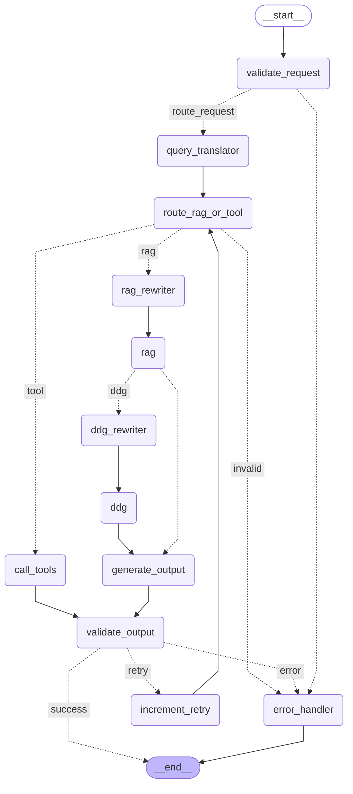

# 🕷️ AIrachnid

Персональный домашний AI-агент на базе LangGraph. Умеет искать игры из личной библиотеки, управлять умным освещением WiZ и медиаплеером VLC — всё через Telegram.

## Возможности

- **Поиск по библиотеке игр** — семантический поиск через RAG (PostgreSQL + pgvector). Если игра не найдена в базе — агент ищет в интернете через DuckDuckGo.
- **Управление освещением** — включить/выключить, яркость, RGB-цвет, переключение режимов (WiZ).
- **Управление медиаплеером** — play/pause/stop, следующий/предыдущий трек, громкость, перемотка (VLC).
- **Telegram UI** — текстовый интерфейс с whitelist пользователей.
- **Мониторинг** — трейсинг всех вызовов через Langfuse.

## Архитектура

### Граф агента (LangGraph)




**Узлы:**

| Узел                | Описание                                                                                                                                                                |
| ------------------- | ----------------------------------------------------------------------------------------------------------------------------------------------------------------------- |
| `validate_request`  | Нормализация, regexp-фильтр на prompt injection. LLM-проверка отключена из-за ложных срабатываний локальной модели — может быть включена при использовании облачных LLM |
| `route_rag_or_tool` | Классификация намерения: поиск игр или управление устройством                                                                                                           |
| `rag_rewriter`      | Переформулирование запроса для векторного поиска                                                                                                                        |
| `rag`               | Семантический поиск по библиотеке игр (pgvector)                                                                                                                        |
| `ddg_rewriter`      | Переформулирование запроса для DuckDuckGo                                                                                                                               |
| `ddg`               | Поиск в интернете если игра не найдена в базе                                                                                                                           |
| `tool_translator`   | Перевод запроса на английский для улучшения tool calling                                                                                                                |
| `call_tools`        | LLM выбирает и вызывает нужный инструмент (WiZ/VLC)                                                                                                                     |
| `tool_node`         | Выполнение инструмента через MCP                                                                                                                                        |
| `tool_result`       | Формулировка ответа по результату инструмента                                                                                                                           |
| `generate_output`   | Формулировка ответа по результатам поиска                                                                                                                               |
| `validate_output`   | Проверка финального ответа на безопасность и полноту                                                                                                                    |
| `error_handler`     | Обработка ошибок                                                                                                                                                        |

**Точки ветвления:**

1. После `validate_request` — пропустить запрос или отклонить
2. После `route_rag_or_tool` — поиск игр или управление устройством
3. После `rag` — результат найден или искать в интернете
4. После `call_tools` — есть tool call или LLM ответила текстом

### Сервисы

```
┌─────────────┐     HTTP    ┌─────────────┐     MCP/HTTP    ┌─────────────┐
│   tg-bot    │ ──────────► │    agent    │ ──────────────► │  mcp-server │
│  (aiogram)  │             │  (FastAPI + │                 │  (FastMCP)  │
└─────────────┘             │  LangGraph) │                 └──────┬──────┘
                            └──────┬──────┘                        │
                                   │                         ┌─────┴─────┐
                            ┌──────┴──────┐                  │ WiZ / VLC │
                            │  postgres   │                  │ (хост)    │
                            │  (pgvector) │                  └───────────┘
                            ├─────────────┤
                            │    redis    │
                            │ (redis-stack│
                            │ + sessions) │
                            └─────────────┘

                            Langfuse Cloud
                            (мониторинг)
                                   │
                            ollama (хост)
                            mxbai-embed-large
                            llama3.1:8b / gemma2:2b
```

### MCP-инструменты

**Освещение (WiZ):**

- `toggle` — переключить состояние
- `turn-on` / `turn-off` — включить/выключить
- `set-brightness` — яркость (0–255)
- `set-rgb` — цвет (RGB 0–255)
- Resource `light://state` — текущее состояние ламп

**Медиаплеер (VLC):**

- `vlc_play` / `vlc_pause` / `vlc_stop` — управление воспроизведением
- `vlc_next` / `vlc_prev` — следующий/предыдущий трек
- `seek` — перемотка (`+30s`, `-1m`, `1h30m`)
- `set_volume` — громкость (0–200%)
- `adjust_volume` — изменить громкость на ±%
- Resource `vlc://status` — текущее состояние плеера

## Стек технологий

| Компонент           | Технология                      | Обоснование                                                  |
| ------------------- | ------------------------------- | ------------------------------------------------------------ |
| Оркестрация агента  | LangGraph                       | Нативная поддержка нелинейных графов, checkpointing          |
| LLM                 | Ollama (llama3.1:8b, gemma2:2b) | Локальный запуск, нет зависимости от облака                  |
| Embeddings          | mxbai-embed-large (Ollama)      | Лучшее качество на смешанных языках среди локальных моделей  |
| Векторное хранилище | PostgreSQL + pgvector           | Единая БД для данных и векторов, не нужен отдельный сервис   |
| Сессии              | Redis Stack                     | TTL из коробки, RediSearch для LangGraph checkpointer        |
| MCP                 | FastMCP (HTTP/SSE)              | Изоляция инструментов в отдельном сервисе, доступ к хосту    |
| Мониторинг          | Langfuse Cloud                  | Трейсинг LangGraph, бесплатный tier (50k observations/month) |
| UI                  | Telegram (aiogram)              | Удобный мобильный интерфейс, whitelist пользователей         |

## Требования

- Docker и Docker Compose
- [Ollama](https://ollama.com/) на хосте с загруженными моделями:
    ```bash
    ollama pull llama3.1:8b
    ollama pull gemma2:2b
    ollama pull mxbai-embed-large
    ```
- VLC запущен с HTTP-интерфейсом:
    ```bash
    vlc --intf http --http-host 127.0.0.1 --http-port 8080 --http-password <пароль>
    ```
- Лампочки WiZ в локальной сети
- Telegram-бот (создать через [@BotFather](https://t.me/BotFather))

## Установка и запуск

### 1. Клонировать репозиторий

```bash
git clone https://github.com/iarspider/airachnid.git
cd airachnid
```

### 2. Настроить переменные окружения

```bash
cp .env.example .env
```

Заполнить `.env` (см. раздел [Переменные окружения](#переменные-окружения)).

### 3. Настроить Ollama

**Вариант А — Ollama на хосте (рекомендуется при наличии GPU):**

Ollama должна быть доступна из Docker-контейнеров. По умолчанию она слушает только на `127.0.0.1` — нужно изменить:

```bash
# /etc/systemd/system/ollama.service.d/override.conf
[Service]
Environment="OLLAMA_HOST=0.0.0.0:11434"
```

```bash
systemctl daemon-reload && systemctl restart ollama
```

В `.env` оставить:

```
OLLAMA_BASE_URL=http://host-gateway:11434
```

**Вариант Б — Ollama в Docker Compose:**

Раскомментировать секцию `ollama` в `docker-compose.yml` и добавить зависимость в `agent`:

```yaml
ollama:
    image: ollama/ollama:latest
    container_name: ollama
    ports:
        - "11434:11434"
    volumes:
        - ollama:/root/.ollama
    restart: unless-stopped
    networks: [internal]
    healthcheck:
        test:
            ["CMD-SHELL", "wget -qO- http://127.0.0.1:11434/api/tags || exit 1"]
    # Для GPU:
    deploy:
        resources:
            reservations:
                devices:
                    - driver: nvidia
                      count: 1
                      capabilities: [gpu]
```

В `.env` изменить:

```
OLLAMA_BASE_URL=http://ollama:11434
```

После запуска загрузить модели:

```bash
docker exec -it ollama ollama pull llama3.1:8b
docker exec -it ollama ollama pull gemma2:2b
docker exec -it ollama ollama pull mxbai-embed-large
```

### 4. Запустить сервисы

```bash
docker compose up -d
```

Порядок старта управляется `depends_on` с `healthcheck` — сервисы поднимаются в правильном порядке автоматически.

### 5. Настроить Langfuse

Зарегистрироваться на [cloud.langfuse.com](https://cloud.langfuse.com), создать проект и скопировать ключи в `.env`:

```
LANGFUSE_BASE_URL=https://cloud.langfuse.com
LANGFUSE_PUBLIC_KEY=pk-lf-...
LANGFUSE_SECRET_KEY=sk-lf-...
```

Бесплатный tier включает 50 000 observations в месяц — достаточно для разработки и личного использования.

### 6. Проиндексировать базу игр

Отправить боту команду `/reindex` в Telegram. Команда создаёт (при первом запуске) или обновляет таблицу эмбеддингов в PGVectorStore — сравнивает игры в основной БД с уже проиндексированными и добавляет новые.

### 7. Написать боту в Telegram

Найти бота по имени заданному при создании, написать `/start`.

## Переменные окружения

Скопировать `.env.example` в `.env` и заполнить:

```env
# PostgreSQL (суперпользователь)
POSTGRES_ADMIN_USER=
POSTGRES_ADMIN_PASSWORD=
POSTGRES_DB=airachnid
POSTGRES_HOST=database
POSTGRES_PORT=5432

# PostgreSQL (пользователи сервисов)
AGENT_DB_USER=agent_user
AGENT_DB_PASSWORD=
LANGFUSE_DB_USER=langfuse_user
LANGFUSE_DB_PASSWORD=

# Redis
REDIS_HOST=cache
REDIS_PORT=6379
REDIS_PASSWORD=

# Ollama (на хосте)
OLLAMA_BASE_URL=http://host-gateway:11434
OLLAMA_MODEL=llama3.1:8b

# MCP-сервер
MCP_SERVER_HOST=mcp-server
MCP_SERVER_PORT=8000

# VLC HTTP API
VLC_HTTP_HOST=127.0.0.1
VLC_HTTP_PORT=8080
VLC_HTTP_PASSWORD=

# WiZ (формат: ip:mac,ip:mac)
WIZ_BULBS=

# Размер вектора (mxbai-embed-large = 1024)
VECTOR_SIZE=1024
TABLE_NAME=game_embeddings

# Агент
AGENT_HOST=agent
AGENT_PORT=8000

# Telegram
TELEGRAM_BOT_TOKEN=
# Whitelist пользователей (Telegram username через запятую)
WHITELIST=

# Langfuse Cloud
LANGFUSE_BASE_URL=https://cloud.langfuse.com
LANGFUSE_PUBLIC_KEY=
LANGFUSE_SECRET_KEY=
```

## Порты

| Сервис     | Порт        | Описание        |
| ---------- | ----------- | --------------- |
| agent      | 8000        | REST API агента |
| mcp-server | 8000 (хост) | MCP HTTP/SSE    |
| postgres   | 5432        | PostgreSQL      |
| redis      | 6379        | Redis           |

## Известные ограничения

- **Локальная модель и русский язык** — llama3.1:8b хуже справляется с tool calling на русском. Запросы к устройствам лучше формулировать на английском. В продакшне решается переводом запроса или более мощной моделью.
- **Семантический поиск** — работает хорошо для точных названий и тематических запросов ("игры про котиков", "open world RPG"), хуже для нестандартных ассоциативных запросов.
- **WiZ** — управление всеми лампочками сразу, без возможности выбрать конкретную. Нет проверки capabilities лампочки перед передачей команды (например, смена цвета на не-RGB лампочке).

## Направления развития

- Переход на облачные embeddings (OpenAI `text-embedding-3-large`) для улучшения качества поиска
- Reranking результатов RAG
- IGDB API вместо DuckDuckGo для поиска игр
- Расширение набора tool для управления WiZ, проверка capabilities лампочки перед передачей команды (например, не пытаться изменить цвет у не-RGB лампочки)
- Поиск треков по XSPF-плейлисту VLC
